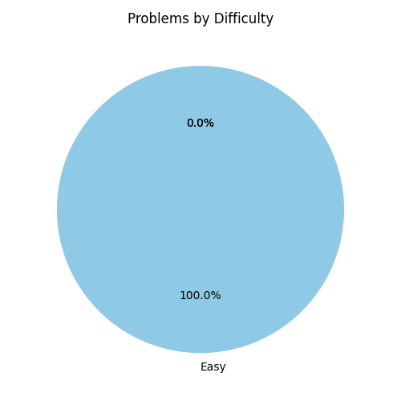

# Daily LeetCode Practice 🧑‍💻

## Total problems solved: 3

<table>
<tr>
<td>



</td>
<td>

## Topics Covered
- [x] array
- [x] hash_table
- [x] sorting
- [x] string

</td>
</tr>
</table>

### Historic log


---

## 🚀 How to Use This Repo

### 📂 Folder Structure

* Place solutions inside one of the difficulty folders:

  ```
  Easy/
  Medium/
  Hard/
  ```
* File naming convention:

  ```
  <problem_number>_<problem_name>.<ext>
  ```

  * Example: `1_two_sum.py`

### 📝 Commit Message Format

Each commit should contain:

1. **Problem number and title** (same as LeetCode)
2. **Topics as hashtags**

Format:

```
<problem_number>. <Problem Title> -- #topic1 #topic2 ...
```

Examples:

```
1. Two Sum -- #array #hashtable
42. Trapping Rain Water -- #stack #two-pointers
```

### 🔄 What Happens Automatically

When you commit and push:

* The problem is logged into `problems.csv`
* Charts are generated in `charts/`:

  * `difficulty_pie.png` → problems by difficulty
  * `cumulative_line.png` → total problems solved over time
* `README.md` is updated:

  * ✅ Total problems solved count
  * ✅ Topics checklist (marked once you’ve solved at least one problem in that topic)

---

### In summary:

1. Pick the right folder.
2. Name the file properly.
3. Use the correct commit message.
4. Push → automation handles the rest.
